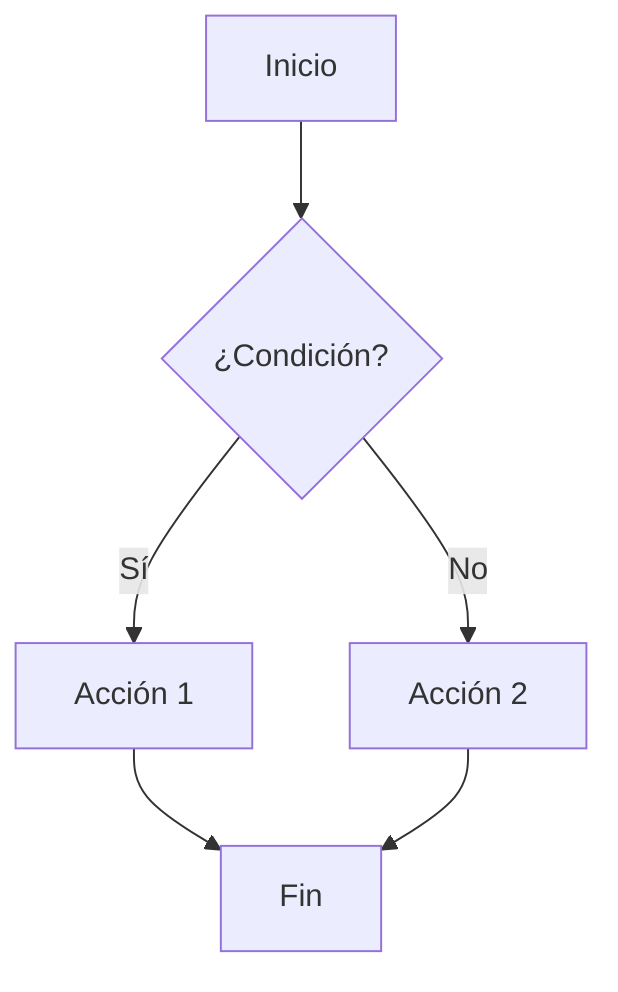

# Guía Avanzada de Markdown

## Extensiones de Markdown

### GitHub Flavored Markdown (GFM)

GitHub extiende Markdown con características adicionales:

#### Listas de tareas

```markdown
- [x] Tarea completada
- [ ] Tarea pendiente
- [ ] Otra tarea pendiente
```

Resultado:

- [x] Tarea completada
- [ ] Tarea pendiente
- [ ] Otra tarea pendiente

#### Menciones y referencias

```markdown
@usuario
#123 (referencia a issue)
SHA: a5c3785ed8d6a35868bc169f07e40e889087fd2e
```

#### Emojis

```markdown
:smile: :heart: :thumbsup: :rocket: :bug: :warning:
```

Resultado: 😄 ❤️ 👍 🚀 🐛 ⚠️

### Diagramas con Mermaid

````markdown

````

````

### Bloques de código con resaltado

```markdown
```python
def fibonacci(n):
    """Calcula el n-ésimo número de Fibonacci."""
    if n <= 1:
        return n
    return fibonacci(n-1) + fibonacci(n-2)

# Ejemplo de uso
print(fibonacci(10))  # Output: 55
````

````

### Tablas avanzadas

```markdown
| Característica | Soporte | Notas |
|:---------------|:-------:|------:|
| Alineación izq | ✅ | Por defecto |
| Alineación centro | ✅ | Con `:---:` |
| Alineación der | ✅ | Con `---:` |
| Celdas vacías | ✅ | Permitido |
````

## Mejores Prácticas para Desarrollo

### 1. Estructura de README.md

Un buen README debe incluir:

````markdown
# Nombre del Proyecto

Descripción breve pero clara del proyecto.

## 🚀 Características

- Característica 1
- Característica 2
- Característica 3

## 📋 Prerrequisitos

- Node.js >= 14.0.0
- npm >= 6.0.0

## 🔧 Instalación

```bash
git clone https://github.com/usuario/proyecto.git
cd proyecto
npm install
```
````

## 💻 Uso

```javascript
const miProyecto = require("./index");
miProyecto.iniciar();
```

## 🧪 Pruebas

```bash
npm test
```

## 🤝 Contribuir

1. Fork el proyecto
2. Crea tu rama (`git checkout -b feature/AmazingFeature`)
3. Commit tus cambios (`git commit -m 'Add some AmazingFeature'`)
4. Push a la rama (`git push origin feature/AmazingFeature`)
5. Abre un Pull Request

## 📄 Licencia

Distribuido bajo la Licencia MIT. Ver `LICENSE` para más información.

## 📞 Contacto

Tu Nombre - [@tutwitter](https://twitter.com/tutwitter) - email@ejemplo.com

````

### 2. Documentación de API

```markdown
## API Reference

### `GET /api/users`

Obtiene la lista de usuarios.

**Parámetros:**
| Parámetro | Tipo | Descripción |
|-----------|------|-------------|
| `page` | `number` | Número de página (opcional, default: 1) |
| `limit` | `number` | Elementos por página (opcional, default: 10) |

**Respuesta:**
```json
{
  "users": [
    {
      "id": 1,
      "name": "Juan Pérez",
      "email": "juan@ejemplo.com"
    }
  ],
  "total": 100,
  "page": 1,
  "limit": 10
}
````

**Códigos de estado:**

- `200` - Éxito
- `400` - Parámetros inválidos
- `500` - Error del servidor

````

### 3. Changelog

```markdown
# Changelog

Todos los cambios notables de este proyecto serán documentados en este archivo.

## [1.2.0] - 2024-01-15

### Añadido
- Nueva funcionalidad de autenticación
- Soporte para temas oscuros
- API de notificaciones

### Cambiado
- Mejorado el rendimiento de la búsqueda
- Actualizada la interfaz de usuario

### Arreglado
- Corregido error en el formulario de login
- Solucionado problema de memoria
````

### 4. Guías de Contribución

```markdown
# Guía de Contribución

## Proceso de Desarrollo

1. **Issues**: Reporta bugs o solicita características
2. **Fork**: Crea un fork del repositorio
3. **Branch**: Crea una rama para tu característica
4. **Código**: Implementa tus cambios
5. **Pruebas**: Asegúrate de que las pruebas pasen
6. **Pull Request**: Envía tu PR con descripción detallada

## Estándares de Código

- Usa ESLint para JavaScript
- Sigue las convenciones de nomenclatura
- Escribe pruebas para nuevas características
- Documenta funciones públicas

## Mensaje de Commit

Sigue el formato conventional commits:
```

tipo(alcance): descripción

[cuerpo opcional]

[pie opcional]

```

Ejemplos:
- `feat(auth): add login functionality`
- `fix(api): resolve user creation bug`
- `docs(readme): update installation guide`
```

## Herramientas Recomendadas

### Editores con soporte Markdown

- VS Code con extensiones Markdown
- Typora
- Mark Text
- Notion

### Linters y formateadores

- markdownlint
- prettier
- remark

### Generadores de documentación

- GitBook
- Docsify
- VuePress
- Docusaurus

---

📚 Anterior: [Guía Básica](guia-basica.md) | Siguiente: [Herramientas](herramientas.md)
